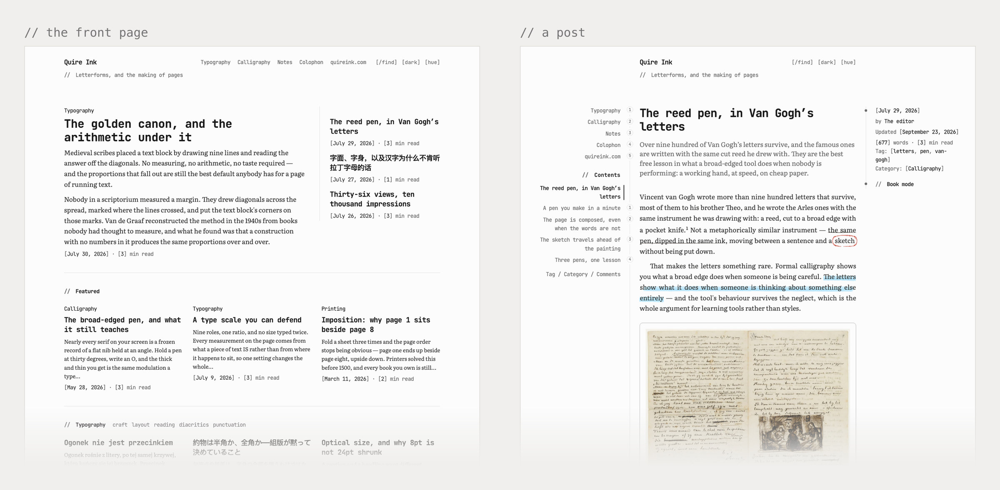
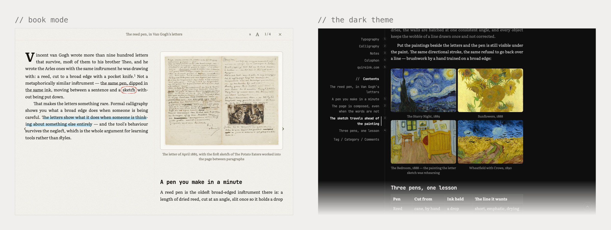
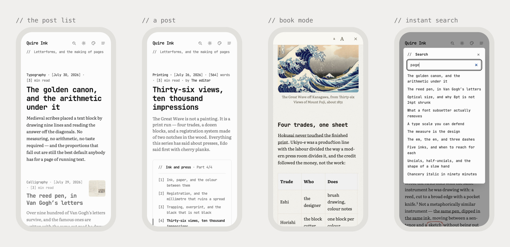
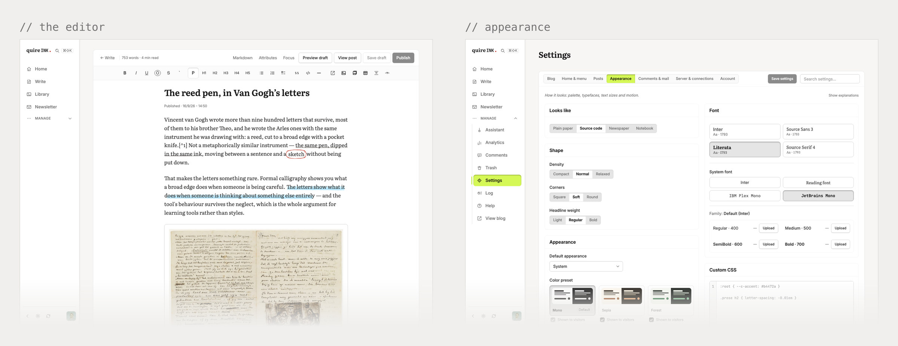
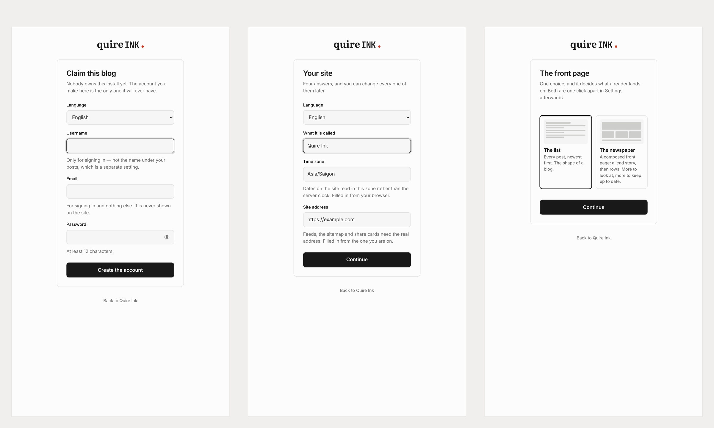

<div align="center">

<picture>
  <source media="(prefers-color-scheme: dark)" srcset="docs/brand/wordmark-dark.svg">
  
</picture>

`2.2.4`

**A blog you host yourself, and an AI agent can run it for you.**
No algorithm, no ads, no platform standing between you and your readers.
One process. Two SQLite files. No cloud account anywhere in the path.

<br/>


**English** · [Tiếng Việt](./README.vi.md)

[**quireink.com**](https://quireink.com) · [**Try it**](https://demo.quireink.com) · [**Install**](#install) · [**Speed**](#speed) · [**Let an agent write**](#let-an-ai-agent-write-for-you-mcp) · [**Changelog**](./CHANGELOG.md) · [**License**](#license)

<br/>



<sub>**[demo.quireink.com](https://demo.quireink.com)** is the real thing. No sign-up, nothing to fill in. Use the bar at the bottom to jump between the front page, the list, an article, book mode, light and dark, and the admin. That bar is the only thing added, and it lives outside the code, so the demo is always the latest build.</sub>

</div>

## What it is

A blog you write in and publish from, on a server you rent.

This first part is for a reader who is not technical. Everything after it is for whoever sets it up.

It has the usual furniture: a front page, posts, categories, a search box, comments, and a newsletter that goes out when you publish. What it has none of is an algorithm deciding who sees your writing, ads across the middle of it, or a company that can change the rules next year.

Colour, type, size, the shape of the front page, the menu: all of it is a setting in the admin, behind your own sign-in, and all of it works from a phone.

Opening a post costs about 100 KB. A photo from your phone is a few dozen times heavier, so a stranger on a weak signal with an old handset still gets the words almost at once. Those are measurements, and [the table](#speed) says how they were taken.

Reading comfort is the point of the project. Six palettes in light and dark, four reading fonts, a book mode set in two columns like paper, and a five-ink highlighter for the lines worth keeping.

An assistant can do the writing. Connect Claude or another MCP client, say *"write a 600-word post about today's trip, tag it travel, publish it"*, and it drafts and publishes through the same rules you use. Its access is a token you can revoke in one click.

To start you need a domain and a rented server; the cheapest tier is enough. That first setup is a technical job, so ask someone who knows servers or hand it to an agent ([Install](#install)). After that the writing, the publishing, the look and the stats all live in the admin, and only an upgrade sends you back to a terminal.

The trade is that you keep your own house. Nobody backs it up for you. There is a button that downloads the entire blog, but pressing it is your job, and the blog lives as long as the server you rent.

A personal blog costs nothing, and you may charge for it: run it inside a business, or sell hosting where every customer gets one. Only a *modified* version used commercially has to ask first ([License](#license)).

## Under the hood

Nothing to deploy and no database to install. Point a domain at one command and you have a blog:

```bash
bun src/index.ts
```

Three decisions shaped everything else.

The reading page is the product, so type, colour, size, spacing and layout are all settings you change in the admin. Not one size or colour is written into the reader's stylesheet, and the build fails if somebody puts one there.

Readers download between 3.9 KB and 10.4 KB of JavaScript, and nothing at all from anyone else. Pages arrive as finished HTML. A few small scripts handle search, the theme switch and book mode; React stays in the admin and never reaches a reader.

An agent can steward as well as write. Any MCP client can draft, tag, schedule and publish, read your traffic, sweep comments and audit the archive, through the rules the admin itself follows.

You can read, change, run and fork it under [PolyForm Noncommercial](./LICENSE), and run the published version commercially, paid hosting included, under [one additional permission](./LICENSE-EXCEPTION.md).

**2.2.4** is the current release. It runs the demo above and the author's own blog at [manhhung.me](https://manhhung.me); the [changelog](./CHANGELOG.md) has everything that changed.

## What you get

| The part | What it does |
|:---|:---|
| 🖋️&nbsp;**Writing** | A real editor over Markdown: tables, video, footnotes, callouts, mathematics, Spotify. Drop in an image and it is cut for every screen, and described for you if you give Settings an AI key. A picture can hold the column, float at a third of it, join its neighbours as a gallery, or wear a paper or ink mat. Saves as you type, keeps three versions, holds a post until Tuesday |
| 🏠&nbsp;**Front&nbsp;page** | The post list, a page you wrote, or a composed front: lead story, picks, a row per category, most read. Works with photographs and with only words. [How it works](./docs/homepage.md) |
| 🎨&nbsp;**Looks** | Six palettes, light and dark. Four reading fonts, or upload your own. Every size comes from a role, so one change moves the whole page instead of one heading |
| 🖍️&nbsp;**The&nbsp;pen** | `==text==` highlights in five inks, `++text++` underlines in pencil, `@@word@@` rings a word in red ballpoint. Strokes grown from a seeded hand, so no two on a page share a shape. Pigments measured off a photograph of a real pen box |
| 💻&nbsp;**Code** | Highlighted on the server, so the reader downloads no highlighter. Twenty-one languages, and the names people actually type. A fence naming nothing is guessed at timidly, so program output stays plain |
| 🔍&nbsp;**Reading** | Search that answers as you type. A rail with your categories and tags, or the contents of the post. Related posts, reading time, a progress bar. Book mode sets a post in two columns with a drop cap, and your place is kept for when you come back |
| 📈&nbsp;**Numbers** | Analytics without cookies: who read what, how far they got, where they came from. Plus an activity log, a trash you can undo, and a help page |
| 💬&nbsp;**Comments** | Readers comment without an account. The page signs its own spam challenge, so no third party sees them; Turnstile takes over only if you add its keys. Sweeping sends comments to the trash, not into nothing |
| 🔎&nbsp;**Search&nbsp;engines** | Sitemap, RSS, `robots.txt`, `llms.txt`, and an OG image drawn per post. Rename a slug and the old URL keeps working |
| 📬&nbsp;**Newsletter** | Sign-ups with a confirmation email, an issue sent when you publish, a note when a comment gets a reply. Your own SMTP, so there is nothing to sign up for |
| 📚&nbsp;**Series** | Write in parts, number them, and every part shows the others |
| 💾&nbsp;**Backups** | One button downloads the whole install. Scheduled snapshots stay on the server, and each one is also shipped to your own R2 or S3 bucket. [Details](./docs/backups.md) |
| 📥&nbsp;**Moving&nbsp;in** | Upload a WordPress XML, a Ghost JSON, or the ZIP Substack or Medium emailed you; the server works out whose it is. Everything becomes Markdown, dead shortcodes are swept out, old URLs answer with redirects, and the images land in your own library |
| 🌍&nbsp;**Languages** | Eleven, in the admin and on the site, and anyone can add one more in a single file. No CJK webfont ships, because they run to megabytes, but each of the three names its own face so 直 is drawn the Japanese way on a Japanese site |
| 🔐&nbsp;**Sign-in** | Your own username and password, hashed with argon2id. An authenticator code every time, and ten recovery codes for the day the phone goes missing. No Google anywhere in the login path |
| 📱&nbsp;**Phone** | Install it to the home screen and it opens like an app |

**Made for** one person, one server, one blog they mean to keep.
**Not made for** a team that needs roles, approvals and an editorial queue. It has one owner on purpose.

<div align="center">



<sub>Book mode and the dark theme. Neither is a filter dropped over the page. Both are the reading typography itself. The fonts ship with Vietnamese and Central European accents included, so the specimen on the left is set properly instead of falling back to whatever the system has.</sub>


<sub>Mathematics is MathML, laid out by the browser itself. No script, no stylesheet, no font file, so a post with a formula costs a reader nothing over one without. Code is highlighted on the server for the same reason. The lower block named no language, so nothing invented colours for it and only what holds for any notation is marked. The pen is an SVG stroke that breaks per line, in five inks.</sub>

</div>

## Speed

These are off the network, first visit, nothing cached. It is what a stranger on a phone actually waits for.

The CSS and JavaScript rows are build artefacts, the same bytes on every install, read off the 2.2.4 build. The totals were measured against a live site running Vietnamese, Literata to read and JetBrains Mono for the furniture. They are not a property of the software: the fonts are cut per script, so a browser fetches only the ranges your pages actually use. The pen's stroke shapes ride in two further immutable sheets, about 20 KB together, and they board only a page that carries a mark or an underline ([ADR 0027](docs/decisions/0027-the-pen-ships-only-where-it-wrote.md)). An inkless page never pays for them. Offline reading adds a service worker of 0.7 KB, fetched once and only on a blog that switched it on.

| | Home | A post | |
|:---|---:|---:|:---|
| **Requests** | 8 | 9 | |
| **Total&nbsp;transferred** | **102&nbsp;KB** | **100&nbsp;KB** | 68&nbsp;KB of that is the fonts |
| **JavaScript** | **4.0&nbsp;KB** | **10.3&nbsp;KB** | written by hand, no framework |
| **CSS** | 9.6&nbsp;KB | 9.6&nbsp;KB | +20&nbsp;KB only on a page carrying the pen |
| **Third&#8209;party&nbsp;requests** | **0** | **0** | no CDN, no font host, no tracker |
| **Coming&nbsp;back** | ~20&nbsp;KB | ~11&nbsp;KB | only the HTML is fetched again; a long post carries more |

It stays this way because of five decisions that are hard to walk back.

Every bundle has a size limit the build enforces, so going over it fails the build. A feature cannot quietly start costing every reader a little more forever.

The page cache is one `Map`, and any write empties all of it. That is the whole rule, which leaves nothing to get subtly wrong. A miss costs a SQLite read and a render, well under a millisecond.

Rendered Markdown is stored under a hash of its input, so nothing ever needs invalidating. A long post went from 383 ms to 1 ms.

The fonts are yours, cut down per language, and only the ones a page needs get preloaded. Pinning one variable-font axis took that set from 97.6 KB to 46.2 KB.

The fade-in and the progress bar are pure CSS: no script, off the main thread, and an old browser simply shows the text.

<div align="center">



<sub>None of this is for a benchmark. It is for someone on a four-year-old phone who wanted to read four hundred words.</sub>

</div>

## Why not something else

**Instead of a hosted platform.** Your writing is two SQLite files on your own disk. No account, no plan, no export button you have to hope still works in five years.

**Instead of WordPress.** No PHP, no MySQL, no plugins to keep patched. One process, and readers get single-digit kilobytes of JavaScript.

**Instead of a static site generator.** You get a real admin. Write, upload a photo, schedule and publish from a laptop or a phone, with search, comments, a newsletter and stats already there. No rebuild, no deploy, no git push to fix a typo.

**Instead of writing your own.** The boring half is done and tested: sign-in with TOTP, sessions, image resizing, feeds, OG images, redirects, an undo for deletes, revisions, backups, importers for WordPress, Ghost, Substack and Medium, eleven languages.

<div align="center">



<sub>The admin is built around writing: the list beside the paper, everything else one sheet per page. Palettes, fonts, sizes, layout and the menu are all settings. None of it is code.</sub>

</div>

## Install

**Where can it live?** Any of these, and the blog is the same on all of them.

- **A rented VPS** — the cheapest tier is enough. The one command below, or Docker.
- **A DigitalOcean droplet** — paste [one file](./deploy/digitalocean/user-data.sh) into the droplet-create page and it is serving three minutes after boot ([how and why](./deploy/digitalocean/README.md)).
- **A NAS in your house** — on **Unraid** search `QuireInk` in Community Applications; on **Synology** (DSM 7.2+) paste the compose into Container Manager, and QNAP's Container Station takes the same. No shell on any of them: the blog prints its claim link to the container log. [Step by step, per box](./docs/self-host-docker.md#on-a-nas-or-a-home-server).
- **Any machine with Docker** — pull `quireink/quireink`, `amd64` and `arm64` both.
- **A Kubernetes cluster** — `kubectl apply -k deploy/kubernetes` on DOKS, EKS, GKE or your own. One pod and one volume, because one blog is one SQLite writer ([the manifests, and why they are a StatefulSet](./deploy/kubernetes/README.md)).

For the first path you need [Bun](https://bun.sh) 1.3 or newer and a machine you can point a domain at. That is the list.

**One command**, which clones, installs, builds and starts it:

```bash
curl -fsSL https://raw.githubusercontent.com/joiha-steven/quireink/main/install.sh | bash
```

It never uses `sudo`, never installs Bun behind your back and never touches systemd; it refuses to run as root, and running it again on the same directory updates and rebuilds instead of failing. Settings go in front of `bash`, on the far side of the pipe: anything in front of `curl` belongs to the download instead.

```bash
curl -fsSL https://raw.githubusercontent.com/joiha-steven/quireink/main/install.sh \
  | SITE_URL=https://example.com QUIREINK_DIR=/srv/blog bash
```

`NO_RUN=1` stops it short of starting the blog, and [the script itself](./install.sh) is 120 readable lines if you would rather look before you pipe.

**Or the same thing by hand**, which is all it does:

```bash
git clone https://github.com/joiha-steven/quireink.git && cd quireink
bun install
bun run build:assets && bun run build:admin     # the islands, then the admin
DATA_DIR=./data SITE_URL=https://example.com bun src/index.ts
```

Put a reverse proxy with TLS in front of the port, `3000` by default. Then read the log. A blog nobody owns yet prints the link that claims it, every time it starts:

```
  ┌─────────────────────────────────────────────────────────────────────────┐
  │  This blog has no owner yet. Open the link below to claim it.           │
  └─────────────────────────────────────────────────────────────────────────┘

  https://example.com/setup?token=…
```

Open it and the rest is a browser: username, email, password, then the QR code for an authenticator and ten recovery codes, once. The token lives in memory, so a restart mints a new one and the old line stops being a secret; `/setup` answers 404 the moment an account exists. Prefer the terminal? `bun run user create --username <name> --email <address>` still does the same job.


<div align="center">



<sub>The whole of setup after the log line. The time zone and the address arrive already filled in, because the browser knows both and both are wrong by default without saying so. What setup does <b>not</b> ask about is the design: palettes, fonts, book mode and the feature switches stay on a dashboard card you can reopen, since nobody can judge them before the site has a single post on it.</sub>

</div>

That is it. The database sets itself up on first boot, so there is no migration step to remember. If you want the full version with systemd, nginx, cache headers, backups and upgrades, it is in **[`docs/self-host.md`](./docs/self-host.md)**.

> [!NOTE]
> **Run from source. That is the whole deployment**, and it is what the live site does. There is
> no compiled binary: `bun build --compile` leaves out `sharp`'s native module, and a binary that
> cannot resize an image is not a shipping artefact
> ([ADR 0022](./docs/decisions/0022-ship-from-source-not-a-compiled-binary.md)).

<details>
<summary><b>🐳 &nbsp;Would rather use Docker?</b> &nbsp;Pull the image, or build it</summary>

<br/>

**Pull it.** Nothing to clone, no Bun, no build step — `linux/amd64` and `linux/arm64`:

```bash
docker run -d --name quire -p 127.0.0.1:3000:3000 \
  -e SITE_URL=https://example.com \
  -v quire-data:/var/lib/quire/data -v quire-uploads:/var/lib/quire/uploads \
  quireink/quireink:latest
docker logs quire            # prints the link that claims the blog — open it in a browser
```

`:latest` on purpose: it is the newest release, and the newest release is the one with the
fixes in it. The version tags below exist for anyone who wants to move by hand instead.

Also on GHCR as `ghcr.io/joiha-steven/quireink`: the same image, pushed by the same run and
carrying the same digest, so the two can never drift.

**On a fresh DigitalOcean droplet** (or any Ubuntu VM with cloud-init): paste
[`deploy/digitalocean/user-data.sh`](./deploy/digitalocean/user-data.sh) into the
droplet-create page's initialization-script box and the blog is serving three minutes
after boot, claim link included ([how and why](./deploy/digitalocean/README.md)).

**Or build it from this repository**, which is what `docker-compose.yml` does:

```bash
cp .env.docker.example .env          # set SITE_URL
docker compose up -d --build
docker compose logs quire            # the claim link, same as above
```

**No `docker exec` and no interactive terminal anywhere in that**, which is the point: a NAS container UI gives you a log panel and no TTY. One service, two volumes, no sidecar. The port listens on `127.0.0.1` only, so a reverse proxy still does TLS.

**On a NAS** (Synology, QNAP, Unraid), mount real folders and set `PUID`/`PGID` to whoever owns them — the container adopts them on first boot and never runs as root. Notes on volumes, ownership and upgrades are in [`docs/self-host-docker.md`](./docs/self-host-docker.md).

</details>

<details>
<summary><b>🤖 &nbsp;Or let an agent install it</b></summary>

<br/>

Give an agent SSH to a fresh server and ask it to set the whole thing up: clone, build, write the systemd unit and the nginx vhost, create your account, hand you back the URL. There is no OAuth client to register and no service to sign up for, so it really can finish the job on its own.

</details>

> [!TIP]
> Uploads have no size limit when you host it yourself, because the browser posts straight to
> your server. Put a CDN in front for TLS and edge caching, and let it obey the
> `cache-control` the app already sends instead of forcing its own.

## Let an AI agent write for you (MCP)

Quire Ink has an **MCP** server built in, so an assistant can draft, edit, tag and publish straight to your live site. No git, no deploy. It goes through the same code the admin does, with the same rules about slugs, revisions and the trash.

1. **Turn it on.** *Admin → Settings → Connections → MCP*, then create a token. You see it once, it is hashed after that, and it dies in 180 days.
2. **Point your agent** at `https://<your-domain>/api/mcp` with `Authorization: Bearer <token>`. OAuth connectors work too.
3. **Ask for a post.**

```text
Using the Quire Ink MCP server, write a 600-word post titled
"What I learned shipping a blog with an AI agent", give it the tags
"ai" and "writing", set a friendly excerpt, and publish it.
```

Writing is half of it. The agent can also read your traffic and compare it to last week, count your subscribers without ever seeing their addresses, sweep comments for spam into the trash rather than out of existence, search the whole archive, and tell you whether a newer release is out. It can steward, too: recompose the front page around what people actually read, restyle the site from the curated palettes and fonts, reply to a comment under your name, send the next newsletter issue as a test to you alone, and take a backup snapshot before anything big. Free-form colour is the one thing it cannot touch, because an agent has no eyes. The [agent cookbook](./docs/agent-cookbook.md) collects prompts that do real jobs: a Monday report, a newsletter draft, an archive audit.

The sensitive settings are off limits over MCP, and you stay in charge. Revoke the token in the admin and it stops working immediately.

The repository also teaches the agent. Three skills ship in `.claude/skills/`, so an assistant that has just cloned this repo already knows how to install a blog, run one over MCP, and move an existing blog in from WordPress, Ghost, Substack or Medium. The import writes the old URLs' redirects and fetches the images itself; the skill then walks whatever is left, starting with the images it could not fetch. Nothing to install: clone it and ask. [What they cover](./docs/agent-ready.md#skills-that-ship-in-the-repository).

## Environment variables

These are the only things that live outside the admin.

| Variable | Needed | What it does |
|---|:---:|---|
| `DATA_DIR` | ✅ | Where `quire.db` and `analytics.db` go. Defaults to `./data` |
| `SITE_URL` | ✅ | Your public address, used in feeds, OG images and email. Leave it empty and every one of them says `http://localhost:3000` — the site still reads fine, so the only things that notice are crawlers and mail clients. It is deliberately not guessed from the request |
| `STORAGE_LOCAL_DIR` | ◻️ | Where uploads go, served at `/uploads`. Defaults to `./uploads` |
| `PORT` | ◻️ | Defaults to `3000` |
| `HOST` | ◻️ | Which interface to listen on. Defaults to `127.0.0.1`, which is right when a reverse proxy sits in front on the same machine. Set `0.0.0.0` when it does not — another machine, or a container that has to be reachable from outside |
| `MAX_UPLOAD_MB` | ◻️ | Largest single upload the app will store. Defaults to `64`, matching the `client_max_body_size` in the recommended vhost so the two refuse the same file. `0` = no limit |
| `STORAGE_QUOTA_GB` | ◻️ | Largest the uploads folder may grow, counting the smaller copies made from each image. Defaults to `5`; an upload that would go past it is refused. `0` = no limit |
| `CRON_SECRET` | ◻️ | Guards `/api/cron`, which publishes scheduled posts and tidies image variants |
| `PURGE_WEBHOOK_URL` | ◻️ | A URL the blog POSTs to whenever it flushes its own cache, for a CDN that is not Cloudflare ([ADR 0033](./docs/decisions/0033-purging-an-edge-that-is-not-cloudflare.md)). Normally entered in Settings → Integrations instead |
| `S3_BUCKET`, `S3_ACCESS_KEY_ID`, `S3_SECRET_ACCESS_KEY` (+`S3_ENDPOINT`, `S3_REGION`, `S3_PREFIX`) | ◻️ | An S3-compatible bucket every snapshot is also shipped to ([ADR 0035](./docs/decisions/0035-the-snapshot-leaves-the-machine.md)). Normally entered in Settings → System instead |
| `CRON_INTERNAL` | ◻️ | Set to `0` to stop the process running its own maintenance clock, when you would rather schedule `/api/cron` yourself. On by default since [ADR 0031](./docs/decisions/0031-the-blog-winds-its-own-clock.md), and never started under `bun test` or `bun --watch` |
| `MCP_OAUTH_SECRET` | ◻️ | Signs MCP OAuth codes. Leave it out and the server makes its own, which is the recommended way |
| `ANALYTICS_TZ` | ◻️ | The site's DEFAULT timezone, used until somebody picks one in **Settings → Site → Timezone**. That setting is the site's whole clock — the date under a post, the month markers, and the day an analytics chart starts on — and it exists because a public page is rendered once and cached, so without it the SERVER's timezone decided what date every reader saw. Defaults to UTC |
| `TRUST_PROXY` | ◻️ | Set to `1` only when the proxy in front reaches you over a PUBLIC address. Rate limits key on the socket address; `CF-Connecting-IP`/`X-Forwarded-For` are believed automatically when the connection came from loopback or a private network |
| `UPDATE_CHECK` | ◻️ | Set to `0` to stop the one request this software makes on its own: once a day, on the first visit your blog gets — or on its own hourly clock if nobody visits — it asks what the newest release is, and by asking, it is counted as a blog being used. What goes out is the version you run, a code rebuilt from a new date every midnight, whether your site has a public address, and four coarse steps: roughly how old the blog is, roughly how much is published, `docker` or `source`, and the admin's language. Never your address, your posts, your readers, or any exact number. On by default, and quiet on its own under `bun --watch` and `bun test` — a development afternoon is not an install. [The whole request is written out here](./docs/update-check.md). The owner has the same switch in Settings → System |

SMTP, Turnstile and CDN credentials go in **Settings → Connections** and stay on the server. Your posts live in `DATA_DIR` and your uploads folder, never in git.

## Translations

The interface speaks **eleven languages** on the reader's side and in the admin: English, Tiếng Việt, Deutsch, 日本語, 简体中文, 한국어, Français, Español, Português (Brasil), Italiano and Русский. The first question setup asks is which one this blog speaks.

**Help translate.** Every language is one folder at the repository root: [`locales/`](./locales). To improve a translation, edit `locales/<code>.ts` (what readers see) and `locales/admin/<code>.ts` (what the owner sees) — plain files of quoted strings. To add a language, copy the two `en` files, translate, and register the code in `locales/langs.ts` + `src/types.ts`; the compiler refuses to build until every key exists, so a half-done translation cannot ship silently. Pull requests welcome — a native speaker's ear beats ours.

## Develop

```bash
bun install
bun run build:admin                 # once, and again whenever src/admin changes
bun run dev                         # http://localhost:3000
# the log prints a /setup link to claim it; or: bun run user create --username me --email me@example.com
```

Nothing is finished until `bun run check:all` passes. It typechecks, runs the static guards and runs the tests, all offline, with no credentials and no services. Start at [`CONTRIBUTING.md`](./CONTRIBUTING.md), which points to the house rules in [`CLAUDE.md`](./CLAUDE.md).

| Where | What is in it |
|---|---|
| `src/` | The whole thing: Bun, Hono, SQLite. [How the pieces fit](./docs/spec/02-structure.md) |
| `docs/` | How it works and why. [`docs/README.md`](./docs/README.md) indexes it; [`docs/decisions/`](./docs/decisions/README.md) is every decision, including the ones that were reversed |
| `golden/` | The rendering contract. One byte of different output fails the build |
| `scripts/checks/` | The guards. Register a write route outside the owner-only group and the build stops, same as a hardcoded font size in the reader's stylesheet |

What is planned lives with the author's own notes rather than here, because it is one
person's intentions for one blog and not a promise to anybody running the software
([ADR 0017](./docs/decisions/0017-move-state-and-instance-config-private.md)). What has
already shipped is in the [changelog](./CHANGELOG.md).

## License

Two different things, and they are not covered by the same terms.

**The code here** is [PolyForm Noncommercial 1.0.0](./LICENSE) plus [one additional permission](./LICENSE-EXCEPTION.md). Source-available, not open source. Together they come to one sentence: **run it, and charge for running it, as long as the version you run is the one published here.**

**Noncommercial: everything.** Your own blog, a hobby project, study, research, and also charities, schools, public research bodies and government. Read it, change it, host it, fork it, pass it on. Keep the licence text and the `Required Notice:` line with any copy you give someone.

**Commercial: yes, unmodified.** Run it for a business, run it for a client, sell hosting where each customer gets their own Quire Ink blog. Four things are asked in return: run a published release with its source unchanged, keep the notices, say your service runs Quire Ink and link back, and sell the service rather than the software. Settings, palettes, fonts and content are not source, so the look of a site is a setting here rather than a fork. It is all in [`LICENSE-EXCEPTION.md`](./LICENSE-EXCEPTION.md), which is short.

**A modified version, used commercially, needs a separate licence.** That is the one line the project holds: change the code and then sell it, or run a changed copy as a service, and you have to ask first. Fixing a bug or a security hole in your own deployment is carved out. Patch it, and tell the owner within 30 days. Ask by opening an issue or through [the owner's GitHub profile](https://github.com/joiha-steven).

**What you write stays yours.** Your posts and images are not covered by the code licence and are not in this repository.

> **Everything up to and including v2.0.0 was MIT, and stays MIT forever.** A licence change
> does not reach backwards: a copy taken before this one keeps the rights it came with. See
> [ADR 0015](./docs/decisions/0015-relicense-polyform-noncommercial.md).
