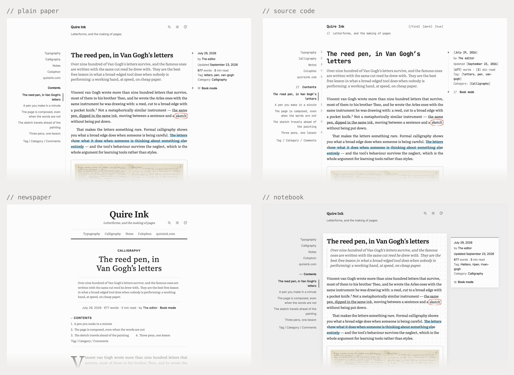
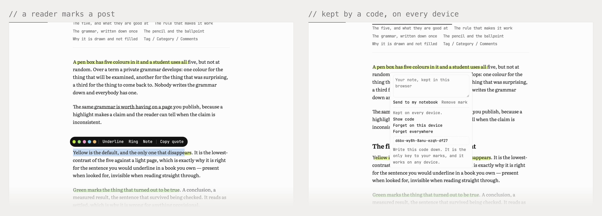

<div align="center">

<picture>
  <source media="(prefers-color-scheme: dark)" srcset="docs/brand/wordmark-dark.svg">
  
</picture>

`2.2.12`

**Blog tự host cho một người viết. Nhờ được AI viết và trông coi hộ.**
Không thuật toán, không quảng cáo, không nền tảng nào đứng giữa bạn và người đọc. Tên bạn trên đó, không phải tên chúng tôi.

<br/>


[English](./README.md) · **Tiếng Việt**

[**quireink.com**](https://quireink.com) · [**Xem thử**](https://demo.quireink.com) · [**Bạn được gì**](#bạn-được-gì) · [**Cài đặt**](#cài-đặt) · [**Để AI viết hộ**](#để-ai-viết-hộ-mcp) · [**Giấy phép**](#giấy-phép)

<br/>


<sub>Bấm [**demo.quireink.com**](https://demo.quireink.com) là xem được ngay, không phải đăng ký hay điền gì. Thanh dưới đáy trang cho bạn nhảy qua lại giữa trang chủ, danh sách bài, một bài viết, chế độ sách, nền sáng nền tối, và cả trang quản trị.</sub>

</div>

> **Nó đang chạy bản demo ở trên và blog của chính tác giả.** Mỗi lần đẩy code đều chạy qua bộ
> test và một vòng tour duyệt mọi màn hình bằng trình duyệt thật, và chỉ cắt bản phát hành khi
> cả hai đều xanh. Lỗi vẫn còn lọt: thấy chỗ nào hỏng thì
> [báo lại](https://github.com/joiha-steven/quireink/issues). Những thứ bản này cố ý **không**
> làm nằm ở [mục bên dưới](#bản-này).

> **Người làm ra nó không biết code.** Từng dòng Quire Ink đều do Claude Code viết; tôi không
> học phần mềm, cũng không có kinh nghiệm phát triển phần mềm nào. Thứ tôi có là thời gian ngồi
> với nó, nên bản mới ra khá đều — và nếu bạn gặp lỗi, cứ
> [mở một issue](https://github.com/joiha-steven/quireink/issues). Có người báo thì tôi mới
> biết, và biết thì tôi sửa sớm nhất có thể.

## Nó là gì

Một cái blog bạn viết và đăng, chạy trên máy chủ bạn thuê. Nó có đủ đồ đạc của một cái blog: trang chủ, bài viết, chuyên mục, ô tìm kiếm, phần bình luận, và bản tin tự gửi email mỗi khi bạn đăng bài. Thứ nó không có là thuật toán quyết định ai được đọc bài bạn, quảng cáo chen ngang, và một công ty có thể đổi luật chơi vào năm sau.

Màu, font, cỡ chữ, bố cục trang chủ, menu: đổi hết trong trang quản trị, sau lần đăng nhập của riêng bạn. Không phải sửa code dòng nào, và làm trên điện thoại cũng được. Trang nhẹ, khoảng 120 KB một bài, nên người lạ ở chỗ sóng yếu cầm máy đời cũ vẫn thấy chữ hiện ra gần như tức thì.

Để bắt đầu bạn cần một tên miền và một máy chủ thuê, loại rẻ nhất là đủ. Riêng lần dựng đầu tiên là việc kỹ thuật, nên nhờ người biết về máy chủ, hoặc [giao hẳn cho một AI agent](#cài-đặt). Đổi lại, bạn tự giữ nhà mình: không ai sao lưu hộ bạn, có sẵn nút tải nguyên cả blog về máy nhưng bấm nó là việc của bạn.

### Bốn thứ không nơi nào có đủ cùng lúc

**Agent chạy được cả cái blog, không chỉ viết bài.** Máy chủ MCP nằm sẵn bên trong và đi qua đúng đoạn mã mà trang quản trị đi qua. Trợ lý soạn, gắn thẻ, hẹn giờ và đăng; nó còn đọc lượng truy cập, đếm người đăng ký mà không thấy email của ai, quét bình luận rác vào thùng rác chứ không xoá hẳn, sắp lại trang nhất theo bài người ta thật sự đọc, và sao lưu trước khi làm gì lớn. Nhiều blog cho robot đăng bài. Cái này giao cho nó cả cái bàn làm việc.

**Người đọc cũng được cầm bút.** Bôi một câu trên bài là hiện thanh chọn năm màu mực, gạch chì, khoanh bút bi, ghi chú và trích, vẽ bằng đúng nét tay của trang. Dấu bám vào chữ chứ không bám vị trí, sống trong trình duyệt của người đọc, và mang sang máy khác bằng một mã hai mươi ký tự chứ không cần tài khoản. Tốn của người đọc 4,5 KB, chỉ ở trang bài, và một công tắc là tắt.

**Trang đọc mới là sản phẩm.** Font, màu, cỡ chữ, khoảng cách và bố cục đều là tuỳ chọn chứ không phải code. Không một cỡ chữ hay màu nào được viết cứng vào stylesheet của người đọc, và bản build đỏ nếu có ai nhét vào.

**Không thương hiệu nào của chúng tôi bị ép lên trang bạn.** Không dòng "powered by": footer là dòng chữ của bạn hoặc không có gì, logo trong admin và dòng phiên bản đều có công tắc tắt.

<details>
<summary><b>Đặt cạnh những lựa chọn quen thuộc</b></summary>

<br/>

- **Thay vì một nền tảng có sẵn.** Bài của bạn là hai tệp SQLite nằm trên ổ đĩa của chính bạn. Không tài khoản, không gói cước, không có cái nút export mà bạn phải cầu cho nó còn chạy sau năm năm.
- **Thay vì WordPress.** Không PHP, không MySQL, không đống plugin phải vá hàng tháng. Một tiến trình, và người đọc chỉ tải về vài KB JavaScript.
- **Thay vì một static site generator.** Bạn có trang quản trị thật. Viết, tải ảnh, hẹn giờ, đăng, từ laptop hay điện thoại. Không build lại, không deploy, không phải git push chỉ để sửa một lỗi chính tả.
- **Thay vì tự viết lấy.** Nửa phần chán đã làm xong và có test: đăng nhập hai lớp, phiên, cắt ảnh, feed, ảnh chia sẻ, chuyển hướng, hoàn tác khi xoá, lịch sử phiên bản, sao lưu, bộ nhập bài, mười một ngôn ngữ.

</details>

Không có gì phải deploy, không phải cài cơ sở dữ liệu nào:

```bash
bun src/index.ts
```

## Bạn được gì

| Phần | Làm được gì |
|:---|:---|
| 🖋️&nbsp;**Viết** | Trình soạn Markdown thật, và bộ máy Markdown là của chính nó: một lần phân tích dựng trang, mở bài trong trình soạn, lưu lại và cắt đoạn tóm tắt. Bảng, video, chú thích chân trang, công thức toán. Thả ảnh vào là tự cắt cho mọi cỡ màn hình. Lưu trong lúc gõ, giữ ba bản gần nhất, hẹn giờ đăng |
| 🏠&nbsp;**Trang&nbsp;chủ** | Danh sách bài, một trang bạn tự viết, hoặc trang nhất kiểu báo dựng sẵn. [Cách hoạt động](./docs/homepage.md) |
| 🎨&nbsp;**Giao&nbsp;diện** | Bốn lối: giấy trơn, mã nguồn, báo in tự đánh số mục, sổ tay kẻ dòng theo đúng giãn dòng của bạn. Phủ lên đó là sáu bảng màu sáng và tối, bốn font đọc hoặc font của bạn. Sửa một chỗ là cả trang đổi theo |
| 🖍️&nbsp;**Cây&nbsp;bút** | `==tô sáng==`, `++gạch chì++`, `@@khoanh bút đỏ@@`. Nét vẽ như tay người, mực không đều, không vệt nào giống vệt nào. Cho người đọc cầm bút nếu bạn muốn. Trang nào cũng link được `/pen.css` để viết bằng mực của bạn |
| 📓&nbsp;**Sổ&nbsp;tay** | Loại viết thứ ba bên cạnh bài và trang: ghi chú và trích đoạn, nguồn của đoạn trích là một trường riêng. Nói IndieAuth, Micropub và Webmention |
| 💻&nbsp;**Code** | Tô màu sẵn ở máy chủ, 346 ngôn ngữ nạp theo nhu cầu. Người đọc không phải tải bộ tô màu nào |
| 🔍&nbsp;**Đọc** | Tìm kiếm hiện kết quả trong lúc gõ, và gõ dấu nào thì ra đúng chữ đó. Mục lục bài, bài liên quan, thời gian đọc. Chế độ sách: hai cột trên nền giấy ở máy bàn, một cột cuộn trên điện thoại, nhớ chỗ đang đọc |
| 📈&nbsp;**Số&nbsp;liệu** | Thống kê không dùng cookie: ai đọc bài nào, đọc tới đâu, đến từ đâu. Không có gì bị xoá, nên bảng theo năm lùi được tới người đọc đầu tiên. Kèm nhật ký hoạt động và thùng rác hoàn tác được |
| 💬&nbsp;**Bình&nbsp;luận** | Người đọc bình luận không cần tài khoản. Chống spam bằng cách tự ký thử thách, không qua bên thứ ba nào |
| 🔎&nbsp;**Máy&nbsp;tìm&nbsp;kiếm** | Sitemap, RSS, `robots.txt`, `llms.txt`, ảnh chia sẻ vẽ riêng cho từng bài. Đổi đường dẫn thì link cũ vẫn chạy |
| 📬&nbsp;**Bản&nbsp;tin** | Đăng ký có email xác nhận, một số tự gửi khi bạn đăng bài. SMTP của riêng bạn |
| 💾&nbsp;**Sao&nbsp;lưu** | Nút tải cả blog về máy, snapshot theo lịch, mỗi snapshot gửi thêm một bản lên bucket R2 hay S3 của bạn. [Chi tiết](./docs/backups.md) |
| 📥&nbsp;**Dọn&nbsp;nhà&nbsp;sang** | Nhập từ WordPress, Ghost, Substack, Medium. Ảnh được tải về, URL cũ được chuyển hướng sẵn |
| 🌍&nbsp;**Ngôn&nbsp;ngữ** | Mười một thứ tiếng, cả trong quản trị lẫn ngoài site, thêm một thứ nữa là thêm một file |
| 🔐&nbsp;**Đăng&nbsp;nhập** | Mật khẩu băm argon2id, mã xác thực mỗi lần vào, mười mã khôi phục, danh sách thiết bị đang đăng nhập kèm nút cắt. Không có Google trong đường đăng nhập |
| 🤖&nbsp;**Trợ&nbsp;lý** | Khoá model của chính bạn: Claude, GPT, Gemini hay DeepSeek. Mỗi cuộc trò chuyện kèm một hoá đơn. Nó còn viết mô tả ảnh và lọc bình luận rác |
| ⌨️&nbsp;**Quản&nbsp;trị** | HTML do máy chủ dựng, hành vi là những mẩu JavaScript viết tay, không framework. ⌘⇧K gõ tên là nhảy thẳng tới thiết lập cần tìm. ⌘F tìm và thay trong bài. Loạt bài, bản nháp, hẹn giờ, và làm trên điện thoại cũng được |

**Làm cho** một người, một máy chủ, một cái blog định giữ lâu dài.
**Không làm cho** một đội cần phân vai, duyệt bài và hàng đợi biên tập. Nó cố ý chỉ có một chủ.

<div align="center">



<sub>Một bài, bốn lối, một bảng màu. Lối quyết định hình dáng, kiểu chữ và các dấu; còn màu trên cả bốn đều lấy từ bảng màu, nên đổi bảng màu là cả bốn đổi theo.</sub>


<sub>Trang quản trị như 2.2.12 vẽ nó: trang do máy chủ dựng, không framework. Mọi thứ bên phải, kể cả bốn lối giao diện, đều là tuỳ chọn bấm chọn chứ không phải code, và khung trên cả hai màn đang mặc một trong số đó.</sub>

</div>

## Người đọc cũng có bút



Bôi một câu trên bất kỳ bài nào là hiện một thanh nhỏ: năm màu mực, gạch chì, khoanh bút bi, ghi chú và chép trích. Dấu vẽ bằng đúng nét tay của trang, bám vào chữ chứ không bám vị trí, nên tác giả sửa lỗi chính tả ba đoạn phía trên thì dấu vẫn nằm yên. Dấu sống trong trình duyệt của người đọc, không gửi đi đâu.

Bấm *Giữ trên mọi thiết bị* là dấu đi theo người: bằng đăng nhập Google sẵn có của người bình luận, hoặc một mã hai mươi ký tự cho ai không muốn đăng nhập gì. Máy chủ chỉ giữ mã băm và một dòng mỗi trang, không bao giờ có email, và chủ blog không thấy gì. *Gửi về sổ tay* mở một trang trên Quire Ink của chính người đọc, hoặc bất kỳ trang nào nói Micropub, với đoạn trích và lời của họ điền sẵn.

Tính năng bật sẵn từ lúc cài, một công tắc để tắt (Cài đặt → Bài viết → *Bút cho người đọc*); chỉ tốn người đọc 4,5 KB script, và chỉ trên trang bài. Thử ngay trên [trang demo](https://demo.quireink.com).

## Tốc độ

Số đo từ mạng, lần vào đầu tiên, chưa cache gì. Đúng bằng cái mà một người lạ cầm điện thoại phải chờ.

**Bản cài MẶC ĐỊNH, không tắt thứ gì.** Đo trên bộ dữ liệu demo, đúng thứ `bun run tour` tự dựng, nên ai có kho mã cũng đo lại được. Số byte đã nén, đo ở origin; ảnh của chính blog đếm riêng vì đó là nội dung của bạn chứ không phải phần mềm. Chế độ đọc sách và cây bút cho người đọc vốn đã BẬT sẵn, ở đây chúng được tính đúng như vậy; cột cuối là phần lấy lại được nếu tắt hai thứ đó đi.

| | Trang chủ | Một bài | Nếu tắt hai thứ đó |
|:---|---:|---:|:---|
| **Số&nbsp;request** | 10 | 16 | 14 |
| **Tổng&nbsp;tải&nbsp;về** | **118,9&nbsp;KB** | **122,8&nbsp;KB** | 114,9&nbsp;KB |
| **JavaScript** | **3,7&nbsp;KB** | **15,9&nbsp;KB** | **8,7&nbsp;KB**; viết tay, không framework |
| **CSS** | 12,4&nbsp;KB | 31,9&nbsp;KB | không đổi: hai tệp vệt bút đi theo vệt của chính tác giả trong bài |
| **Font** | 91,5&nbsp;KB | 65,3&nbsp;KB | cắt theo từng hệ chữ, nên đây là dòng duy nhất do nội dung của bạn quyết: tiêu đề trong demo chạy qua ba bảng chữ cái |
| **Request&nbsp;bên&nbsp;thứ&nbsp;ba** | **0** | **0** | không CDN, không font host, không tracker |
| **Lần&nbsp;vào&nbsp;sau** | **0&nbsp;byte** | **0&nbsp;byte** | đúng trang đó trả `304` |

Giữ được như vậy là nhờ mấy luật cứng: mỗi gói JavaScript có hạn mức dung lượng do bản build canh, vượt là build đỏ; trang quản trị không còn framework nào, và phần đó chưa bao giờ chạm tới người đọc; font cắt gọn theo từng ngôn ngữ và chỉ nạp sẵn mặt chữ mà trang thật sự vẽ bằng nó. Không con số nào ở đây để lấy điểm benchmark, chúng dành cho một người cầm chiếc điện thoại bốn năm tuổi, chỉ muốn đọc bốn trăm chữ. [Cách đo và các quyết định phía sau](./docs/performance.md).

## Bản này

**2.2.12** trả lại trợ lý cho những ai dùng Google Gemini, và ngăn hai màn quản trị vẽ nguyên bảng dữ liệu của chúng. Nó đang chạy trang demo ở trên lẫn blog của chính tác giả tại [manhhung.me](https://manhhung.me). [Nhật ký thay đổi](./CHANGELOG.md) ghi đủ, kèm số đo từng mục.

- **Gemini trả lời lại được.** Từ 2.2.10 nó từ chối mọi câu hỏi, mà không một dòng mã nào trong kho này đổi: một bản zod mới bắt đầu viết kiểu `string | number | boolean` của một công cụ thành mảng kiểu thay vì `anyOf`, còn bộ đọc lược đồ của Google chỉ nhận một kiểu ở chỗ đó, nên nó từ chối nguyên yêu cầu bằng lỗi 400. Trang quản trị chỉ biết báo là "kiểm tra lại khoá", trong khi khoá hoàn toàn đúng. Được báo ở [#66](https://github.com/joiha-steven/quireink/issues/66).
- **Model Gemini mặc định nay là model còn tồn tại.** Google đã tắt hẳn `gemini-2.0-flash` ngày 1 tháng 6, mà đó lại là model dùng thay cho ai dán khoá vào rồi lưu mà không tự chọn, tức là đường đi mặc định. Từ đó tới nay, việc mô tả ảnh, tóm tắt và gác bình luận trên các blog ấy hỏng trong im lặng.
- **Thư viện chia trang**, mỗi trang 200, còn cột bài viết vẽ một trăm dòng rồi cuộn tới đâu hiện thêm tới đó. Mọi bài vẫn nằm sẵn trong trang, nên ô tìm kiếm vẫn với tới được bài nằm sâu sáu trăm dòng.
- **Đường dẫn mở đầu bằng hai dấu gạch chéo không còn đưa người đọc rời khỏi trang.** Lệnh chuyển hướng cắt dấu gạch cuối đã trả lời `//evil.example/` bằng một `Location` trỏ sang tên miền khác, nên một đường dẫn mang tên miền của chính blog lại dẫn đi nơi khác.
- **Ba nút trong trang quản trị thôi báo thành công khi chưa làm gì:** nút "Lưu và thử" của bản sao lưu ngoài máy chủ không hề thử trên mọi bản cài vốn đã có kho chứa, thẻ đang giữ khoá không chuyển sang màu hổ phách khi có sửa chưa lưu, và nút mở phần cài đặt đăng nhập của người đọc bấm vào không đi đâu cả.

**2.2.10 và 2.2.11, ba hôm trước,** là chỗ phép trừ diễn ra.

**Hai mươi hai gói khai báo rời đi, mười hai gói đi vào**, trong đó có React, bảy gói `@tiptap/*` bọc quanh trình soạn thảo, `marked` và Tailwind CLI. Số gói khai báo đi từ 32 xuống 22, tệp khoá phiên bản từ 360 gói xuống 221, và bản cài sạch từ 194 MB xuống 138 MB.

- **Trang quản trị trở lại là HTML do máy chủ dựng**, hành vi gắn thêm bằng những mẩu JavaScript viết tay. Màn hình hiện ra là đã xong: thời gian tới lúc thấy tiêu đề đi từ 1.038ms xuống 285ms ở màn Nhật ký và 940ms xuống 336ms ở Bảng tin, đo bản cũ với bản mới trên cùng một cơ sở dữ liệu ở 500 KB/s. Thứ trình duyệt phải có trước khung hình đầu tiên là **63,7 KB** sau nén: HTML của chính trang, tệp kiểu dáng của trang quản trị, và một mẩu script khởi động 496 byte, đo nguội từ máy chủ gốc ngày 19/09/2026. Dòng này ghi 22 KB cho tới hôm đó, và không phép đo nào ở đây dựng lại được con số ấy. Cái giá, nói thẳng: bấm vào một dòng giờ là chuyển trang thật, nên mở lại một bài vừa mở đi từ 12ms lên 107ms.
- **Trình soạn thảo đứng thẳng trên ProseMirror.** Thời gian tới lúc gõ được đi từ khoảng 395ms xuống khoảng 107ms, và 45 mẫu đối chiếu cho ra Markdown giống nhau từng byte qua cả trình soạn cũ lẫn mới. Đó là điều kiện để làm.
- **Bộ máy Markdown là của chính nó**, đo theo CommonMark 0.31.2 đạt 648 trên 652 ví dụ và GFM 24 trên 24 mỗi lần chạy, không phụ thuộc thư viện nào.
- **Người đọc được cầm bút**, dấu đi theo người bằng một mã chứ không cần tài khoản, và ghi chú với trích đoạn thành loại viết thứ ba, nói được IndieAuth, Micropub và Webmention.
- **Bốn lối giao diện**, chọn ở câu hỏi cuối cùng lúc cài, và sáu bảng màu nay giải cùng một độ tương phản nên chỉ khác nhau ở sắc màu.
- **Người đọc tải về ít hơn bản 2.2.9**: một bài còn 122,8 KB thay vì 131, trang chủ còn 118,9 KB thay vì 128. [Bảng ở trên](#tốc-độ) ghi từng dòng.

**Và bản này KHÔNG làm được gì.** Không có chế độ nhiều người dùng: một blog, một chủ, một tiến trình; phần bình luận có tài khoản còn phần viết thì không. NAS và Kubernetes cố ý không có Caddy, vì cả hai đã có sẵn chỗ cắt TLS riêng. Hai máy đánh dấu cùng một trang cùng lúc thì ghi đè nhau, lần lưu sau thắng. Trang quản trị chưa có màn nào cho biết đoạn nào được người đọc giữ nhiều nhất, mới có tool MCP `list_mentions` trả lời. Webmention có kiểm nguồn và giới hạn tốc độ nhưng chưa nối bộ lọc rác. Gõ tiếp ngay sau một liên kết thì chữ rơi vào trong liên kết đó, đã tìm ra và cố ý để nguyên, có test ghim lại để nó không tự đổi khi chưa ai quyết. Có bốn lối giao diện và không có lối thứ năm, lối áp cho cả site và chỉ thay trang đã xuất bản, muốn đi xa hơn vẫn phải viết CSS riêng. Bước nâng cấp STARTTLS chỉ được chứng minh trên một relay thật lúc deploy chứ không ở đâu khác, do Bun không biến được một socket đang mở thành TLS ở phía máy chủ. Ô tìm kiếm tên trong thư viện chỉ lọc trong trang đang mở chứ không lọc cả thư viện, đó là cái giá của việc chia trang. Màn Trợ giúp vẫn chỉ tiếng Anh, vài chỗ đếm vẫn ra "1 words", công tắc Chuyển động là của chủ chứ không theo từng người đọc, bản cài chèn HTML bằng `sub_filter` của nginx mất nén và ETag của origin, và origin không CDN thì người đọc ở nửa kia địa cầu trả thêm một vòng mạng mà số byte tiết kiệm không mua lại được.

## Cài đặt

Cài lên đâu cũng được, và blog y hệt nhau ở mọi chỗ:

- **VPS thuê ngoài**, gói rẻ nhất là đủ. Một lệnh bên dưới, hoặc Docker.
- **Droplet DigitalOcean**: dán [một file](./deploy/digitalocean/user-data.sh) vào ô initialization script lúc tạo máy, ba phút sau là blog chạy ([cách làm](./deploy/digitalocean/README.md)).
- **NAS trong nhà**: Unraid tìm `QuireInk` trong Community Applications; Synology dán file compose vào Container Manager, QNAP vào Container Station. Không cần dòng lệnh nào ([từng bước](./docs/self-host-docker.md#on-a-nas-or-a-home-server)).
- **Máy nào có Docker**: kéo `quireink/quireink` về, có sẵn cho `amd64` và `arm64`.
- **Cụm Kubernetes**: `kubectl apply -k deploy/kubernetes` ([bộ manifest](./deploy/kubernetes/README.md)).

Cách thứ nhất cần [Bun](https://bun.sh) 1.3 trở lên và một máy trỏ tên miền vào được. Chỉ vậy thôi.

**Một lệnh** là nó tự tải mã nguồn, cài, dựng và chạy blog lên:

```bash
curl -fsSL https://raw.githubusercontent.com/joiha-steven/quireink/main/install.sh | bash
```

Lệnh này không dùng `sudo`, không tự cài Bun sau lưng bạn, không đụng tới systemd, và từ chối chạy dưới quyền root. Chạy lại lần nữa trên cùng thư mục thì nó cập nhật chứ không báo lỗi. [Bản thân cái script](./install.sh) dài 136 dòng, đọc trước được nếu bạn muốn xem nó làm gì.

Xong, bạn đọc log. Blog chưa có chủ sẽ tự in ra đường dẫn để nhận:

```
  ┌─────────────────────────────────────────────────────────────────────────┐
  │  This blog has no owner yet. Open the link below to claim it.           │
  └─────────────────────────────────────────────────────────────────────────┘

  https://example.com/setup?token=…
```

Mở link đó ra là xong phần còn lại ngay trong trình duyệt: tên đăng nhập, email, mật khẩu, rồi mã QR cho ứng dụng xác thực và mười mã khôi phục. Token nằm trong bộ nhớ, nên khởi động lại là có token mới và dòng log cũ hết là bí mật.

<div align="center">


<sub>Toàn bộ phần cài đặt sau dòng log. Múi giờ và địa chỉ site đến nơi đã điền sẵn. Bảng màu, phông chữ và các công tắc tính năng cố ý không hỏi ở đây, vì chưa có bài nào thì chưa ai chọn nổi.</sub>

</div>

<details>
<summary><b>🐳 &nbsp;Thích Docker hơn</b></summary>

<br/>

Không cần clone, không cần Bun, không phải dựng gì:

```bash
docker run -d --name quire -p 127.0.0.1:3000:3000 \
  -e SITE_URL=https://example.com \
  -v quire-data:/var/lib/quire/data -v quire-uploads:/var/lib/quire/uploads \
  quireink/quireink:latest
docker logs quire            # in ra đường dẫn nhận blog
```

Dùng `:latest` là cố ý: bản mới nhất là bản đã có các lỗi được sửa. Thẻ theo số phiên bản dành cho ai muốn tự quyết lúc nào thì đổi. Trên GHCR cũng có, `ghcr.io/joiha-steven/quireink`, cùng một image cùng một digest.

Cổng chỉ mở trên `127.0.0.1`, nên reverse proxy vẫn là chỗ lo TLS. Trên NAS thì gắn thư mục thật và đặt `PUID`/`PGID` theo người sở hữu thư mục đó; container tự nhận quyền ở lần khởi động đầu và không bao giờ chạy bằng root. Ghi chú đầy đủ ở [`docs/self-host-docker.md`](./docs/self-host-docker.md).

</details>

<details>
<summary><b>🤖 &nbsp;Hoặc để AI agent cài giúp</b></summary>

<br/>

Đưa SSH của một máy chủ trắng cho agent rồi bảo nó dựng hết: tải mã nguồn, build, viết unit systemd và vhost nginx, tạo tài khoản, trả lại cho bạn cái URL. Không có OAuth client nào phải đăng ký, không dịch vụ nào phải mở tài khoản, nên nó làm trọn được thật.

</details>

Muốn bản đầy đủ với systemd, nginx, cache header, sao lưu và nâng cấp thì xem [`docs/self-host.md`](./docs/self-host.md).

## Để AI viết hộ (MCP)

Quire Ink có sẵn một máy chủ **MCP**, nên trợ lý AI soạn, sửa, gắn thẻ và đăng thẳng lên site đang chạy của bạn được. Không git, không deploy. Nó đi qua đúng đoạn mã mà trang quản trị đi qua.

1. **Bật lên.** *Quản trị → Cài đặt → Máy chủ & kết nối → MCP*, tạo một token. Bạn thấy nó đúng một lần, sau đó nó được băm, và nó hết hạn sau 180 ngày.
2. **Trỏ agent** vào `https://<tên-miền-của-bạn>/api/mcp` với `Authorization: Bearer <token>`.
3. **Bảo nó viết bài.**

```text
Dùng máy chủ MCP của Quire Ink, viết một bài 600 chữ tựa đề
"Những gì tôi học được khi dựng blog cùng AI agent", gắn thẻ
"ai" và "writing", đặt một đoạn tóm tắt dễ chịu, rồi đăng.
```

Viết mới là một nửa. Agent còn đọc được lượng truy cập, đếm người đăng ký mà không bao giờ thấy email của họ, quét bình luận rác vào thùng rác, tìm khắp kho bài, sắp lại trang nhất theo bài người ta thật sự đọc, và sao lưu trước khi làm gì lớn. Thu hồi token trong trang quản trị là nó mất quyền ngay. [Sổ tay agent](./docs/agent-cookbook.md) gom sẵn những câu lệnh làm việc thật.

Kho mã này còn dạy luôn cho agent: ba bộ kỹ năng nằm trong `.claude/skills/`, nên một trợ lý vừa tải kho về là đã biết cách dựng blog, vận hành nó qua MCP, và dọn nhà từ WordPress, Ghost, Substack hay Medium sang. [Chúng gồm những gì](./docs/agent-ready.md#skills-that-ship-in-the-repository).

## Cấu hình

Gần như mọi thứ nằm trong trang quản trị. Chỉ vài biến môi trường là ở ngoài:

| Biến | Bắt buộc | Nó làm gì |
|---|:---:|---|
| `DATA_DIR` | ✅ | Chỗ để `quire.db` và `analytics.db`. Mặc định `./data` |
| `SITE_URL` | ✅ | Địa chỉ công khai của bạn, dùng trong feed, ảnh chia sẻ và email |
| `PORT` | ◻️ | Mặc định `3000` |
| `HOST` | ◻️ | Mặc định `127.0.0.1`, đúng khi reverse proxy đứng cùng máy |

Danh sách đầy đủ nằm ở [bảng biến môi trường của README](./README.md#environment-variables); sao lưu lên S3 ở [`docs/backups.md`](./docs/backups.md). Không có thương hiệu nào bị ép lên bạn: footer là dòng chữ của bạn hoặc không có gì, logo trong admin có công tắc tắt, dòng phiên bản ở chân bảng điều khiển cũng vậy.

Mỗi ngày một lần, blog hỏi máy chủ xem đã có bản mới chưa, và chính lúc hỏi thì được đếm là một blog đang được dùng. Nó gửi đi phiên bản đang chạy và bốn nấc thô về blog, không có địa chỉ, bài viết hay người đọc nào. Tắt bằng `UPDATE_CHECK=0` hoặc một công tắc trong Cài đặt. [Toàn bộ nội dung cú gọi](./docs/update-check.md).

## Bản dịch

Giao diện nói mười một thứ tiếng: English, Tiếng Việt, Deutsch, 日本語, 简体中文, 한국어, Français, Español, Português (Brasil), Italiano và Русский.

Mời bạn góp bản dịch. Mỗi ngôn ngữ là hai file chữ thuần trong [`locales/`](./locales) (`locales/<mã>.ts` cho người đọc, `locales/admin/<mã>.ts` cho chủ blog), sửa được mà không cần biết lập trình. Trình biên dịch từ chối build khi còn thiếu một chuỗi, nên bản dịch dở dang không lọt ra ngoài được. Tai người bản xứ vẫn hơn tai chúng tôi.

## Góp code

```bash
bun install
bun run build:admin                 # một lần, và mỗi khi src/admin đổi
bun run dev                         # http://localhost:3000
```

Chưa qua `bun run check:all` thì chưa xong. Nó typecheck, chạy các guard tĩnh và chạy test, tất cả offline, không cần thông tin đăng nhập của ai. Bắt đầu ở [`CONTRIBUTING.md`](./CONTRIBUTING.md), từ đó dẫn tới luật nhà trong [`CLAUDE.md`](./CLAUDE.md). Mã nguồn nằm trong `src/`, tài liệu trong [`docs/`](./docs/README.md), và [mọi quyết định](./docs/decisions/README.md) đều được ghi lại kể cả những cái đã bị đảo ngược.

## Giấy phép

Mã nguồn theo [PolyForm Noncommercial 1.0.0](./LICENSE) cộng [một cho phép bổ sung](./LICENSE-EXCEPTION.vi.md). Xem được mã nguồn, nhưng không phải open source. Gọn trong một câu: **cứ chạy, và cứ thu tiền, miễn là bản bạn chạy đúng là bản phát hành ở đây.**

- **Phi thương mại thì được tất.** Blog của bạn, dự án chơi cho vui, học tập, nghiên cứu, trường học, tổ chức từ thiện, cơ quan nhà nước. Đọc, sửa, tự host, fork, chuyển cho người khác đều được.
- **Thương mại được, nếu không sửa code.** Chạy cho doanh nghiệp, chạy cho khách hàng, bán hosting mà mỗi khách một blog riêng. Đổi lại: chạy đúng một bản phát hành với mã nguồn nguyên vẹn, giữ các dòng ghi chú bản quyền, nói rõ dịch vụ của bạn chạy trên Quire Ink kèm link về đây, và bán dịch vụ chứ không bán phần mềm.
- **Sửa code rồi đem đi kinh doanh thì phải hỏi trước.** Đây là ranh giới duy nhất dự án giữ lại. Vá lỗi hay bịt lỗ hổng bảo mật trên bản cài của chính bạn thì được miễn, chỉ cần báo lại trong vòng 30 ngày.
- **Những gì bạn viết vẫn là của bạn.** Bài và ảnh của bạn không thuộc giấy phép mã nguồn.
- **Nếu dự án có ngày im lặng, nó tự mở ra.** 48 tháng không có bản phát hành nào thì mã nguồn ở trạng thái lúc đó cũng thuộc về bạn theo Apache License 2.0, bằng một giấy phép đã trao sẵn từ hôm nay. Không cần ai còn liên lạc được. Đó là mục 6 của [cho phép bổ sung](./LICENSE-EXCEPTION.vi.md).

Cấu hình, bảng màu, font và nội dung không tính là mã nguồn, vì giao diện là thứ chỉnh trong cài đặt, không cần fork.

> **Mọi thứ tính tới hết v2.0.0 là MIT, và mãi mãi là MIT.** Đổi giấy phép không có hiệu lực lùi: bản nào lấy về trước lần đổi này thì giữ nguyên quyền đã được trao. Xem [ADR 0015](./docs/decisions/0015-relicense-polyform-noncommercial.md).

