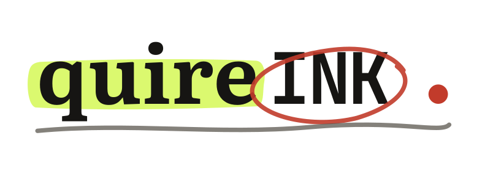
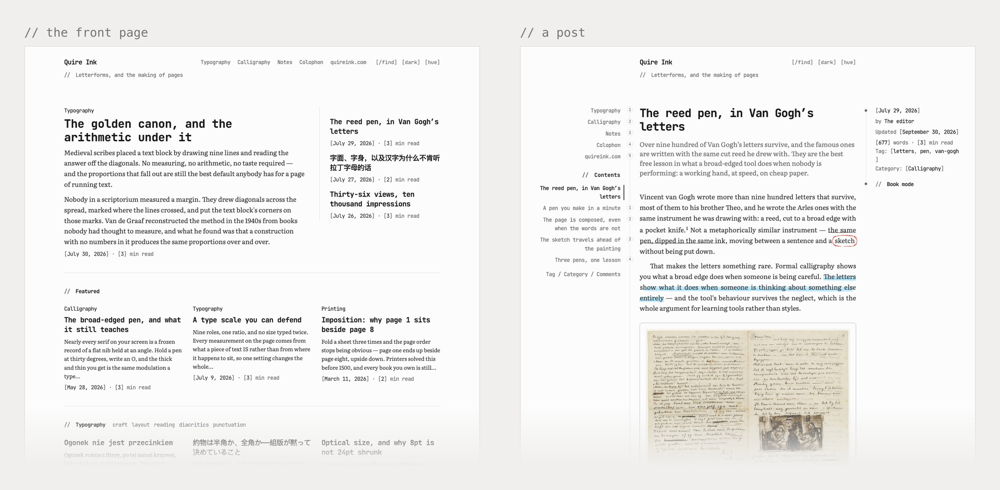
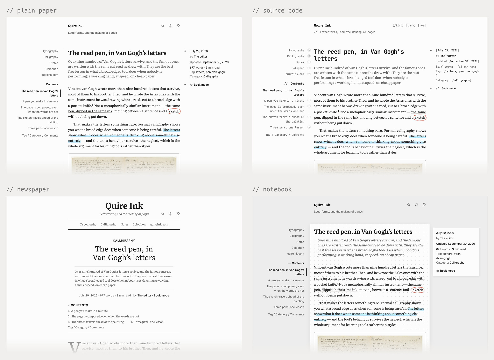
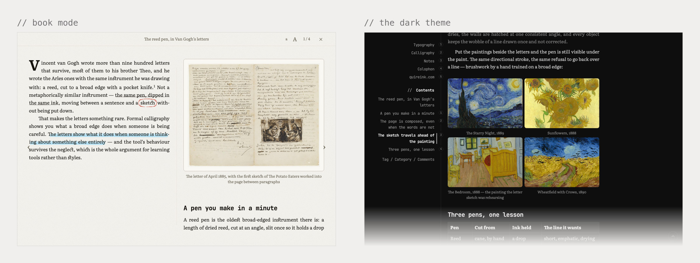
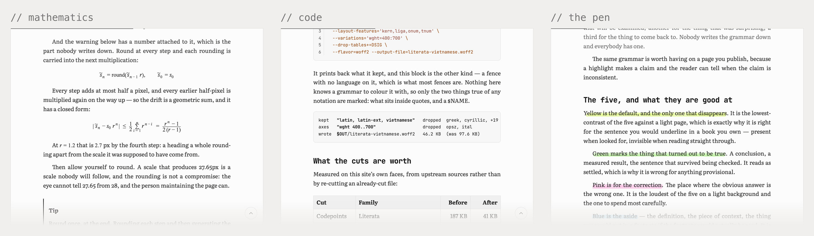
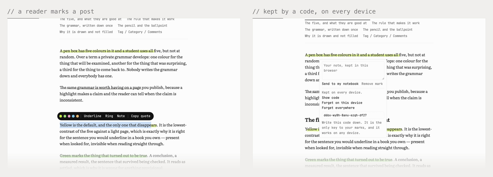
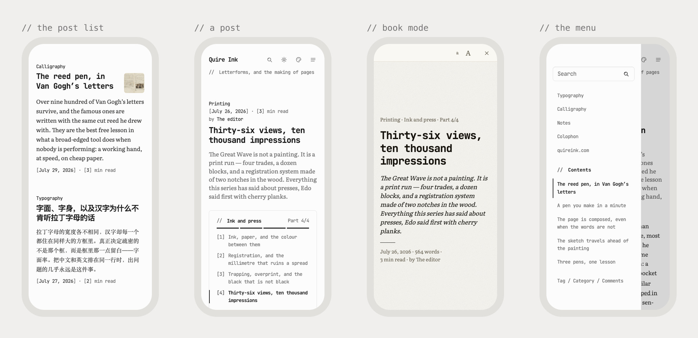
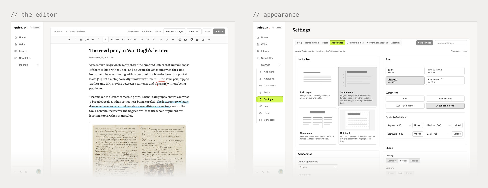
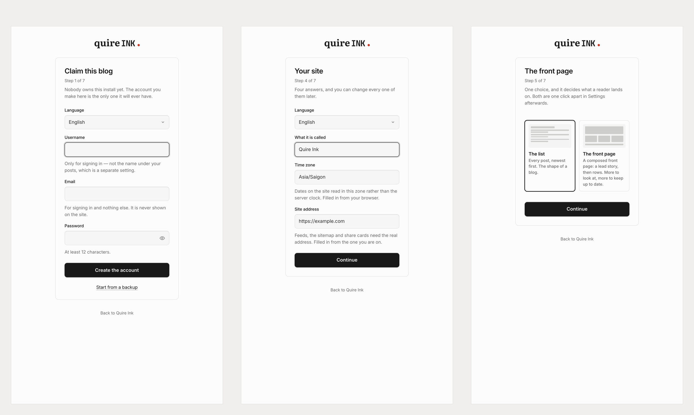

<div align="center">

<picture>
  <source media="(prefers-color-scheme: dark)" srcset="docs/brand/wordmark-dark.svg">
  
</picture>

`2.2.19`

**Blog tự host cho một người viết. Nhờ được AI viết và trông coi hộ.**
Không thuật toán, không quảng cáo, không nền tảng nào đứng giữa bạn và người đọc. Tên bạn trên đó, không phải tên chúng tôi.

<br/>

 

[English](./README.md) · **Tiếng Việt**

[**quireink.com**](https://quireink.com) · [**Xem thử**](https://demo.quireink.com) · [**Cài đặt**](#cài-đặt) · [**Tài liệu**](#đọc-tiếp-ở-đâu) · [**Bản đầy đủ**](./docs/overview.vi.md) · [**Giấy phép**](#giấy-phép)

<a href="https://deploy.workers.cloudflare.com/?url=https://github.com/joiha-steven/quireink/tree/release"><picture><source media="(prefers-color-scheme: dark)" srcset="docs/brand/button-cloudflare-dark.svg"></picture></a>&nbsp;&nbsp;<a href="#cài-đặt"><picture><source media="(prefers-color-scheme: dark)" srcset="docs/brand/button-server-dark.svg"></picture></a>

<br/>



<sub>Bấm [**demo.quireink.com**](https://demo.quireink.com) là xem được ngay, không phải đăng ký hay điền gì. Thanh dưới đáy trang cho bạn nhảy qua lại giữa trang chủ, danh sách bài, một bài viết, chế độ sách, nền sáng nền tối, và cả trang quản trị.</sub>

</div>

## Nó là gì

Một blog để viết và đăng bài, chạy trên máy chủ bạn thuê. Có đủ thứ thường thấy — trang chủ, bài viết, chuyên mục, tìm kiếm, bình luận, bản tin gửi đi mỗi khi đăng bài — và không có thuật toán nào quyết định ai được đọc bạn, không quảng cáo chen giữa bài, không công ty nào đổi luật vào năm sau.

Màu, chữ, bố cục trang chủ và menu đều là cài đặt trong trang quản trị, và làm được từ điện thoại. Dựng lần đầu là việc kỹ thuật — nhờ người biết về máy chủ, hoặc giao cho một AI agent. Sau đó bạn chỉ việc viết, và chỉ lúc nâng cấp mới phải mở terminal.

**Làm cho** một người, một máy chủ, một blog muốn giữ lâu. **Không làm cho** một nhóm cần phân quyền, duyệt bài và hàng đợi biên tập.

## Điểm nổi bật

- **Trình soạn Markdown thật**, có bảng, chú thích, hộp ghi chú, công thức, bộ ảnh và video. Tự lưu khi gõ, giữ các bản cũ, hẹn giờ đăng.
- **Bốn kiểu giao diện, sáu bảng màu, bốn font đọc**, sáng và tối, và chế độ sách dàn bài thành hai cột như trang giấy.
- **Cây bút cho bạn và cho người đọc**: tô năm màu mực, gạch chân, khoanh chữ — vẽ tay, không nét nào giống nét nào.
- **Đăng nhập bằng passkey** (vân tay, khuôn mặt hoặc mã PIN của máy) bên cạnh mật khẩu và mã xác thực, không thay chúng.
- **Thống kê không dùng cookie**, theo từng bài và cả site, và bản tin gửi bằng máy chủ mail của bạn.
- **Dọn vào và dọn ra**: nhận WordPress, Ghost, Substack hay Medium; xuất ra một ZIP Markdown.
- **Một AI agent trông được nó.** Máy chủ MCP có sẵn cho trợ lý viết nháp, đăng bài, đọc số liệu và dọn dẹp, theo đúng luật mà trang quản trị theo.
- **Nhanh trên máy nhỏ.** Một tiến trình Bun, hai file SQLite, không máy chủ cơ sở dữ liệu, không cần tài khoản đám mây nào.
- **Mười một thứ tiếng**, trong trang quản trị và trên site.

Từng phần, chi tiết và so với các lựa chọn khác: [**Quire Ink, bản đầy đủ**](./docs/overview.vi.md).

## Xem qua



<sub>**Bốn lối giao diện, một lựa chọn.** Cùng một bài ở dạng giấy thường, mã nguồn, bài báo và sổ tay. Giao diện quyết định hình khối, kiểu chữ và các dấu; màu thì luôn do bảng màu quyết định.</sub>



<sub>**Chế độ đọc sách và nền tối.** Bài nào cũng mở được thành sách có lật trang, bắt đầu bằng một trang tựa; bảng màu nào cũng được vẽ hai lần, cho nền sáng và nền tối.</sub>



<sub>**Công thức, code và cây bút.** Công thức là MathML thật, code được tô màu ngay trên máy chủ, và cây bút tô, gạch chân, khoanh tròn chữ như tay vẽ.</sub>



<sub>**Người đọc cũng cầm bút.** Dấu của họ nằm trong trình duyệt của chính họ, và chỉ đi theo sang thiết bị khác khi họ muốn.</sub>



<sub>**Trên điện thoại:** danh sách bài, một bài có thanh tiến độ loạt bài, chế độ đọc sách và ngăn menu có ô tìm kiếm ở trên cùng.</sub>



<sub>**Trang quản trị.** Trình soạn thảo bên trái, bên phải là phần cài đặt quyết định site trông ra sao: tất cả đều là tuỳ chọn, không phải viết code.</sub>



<sub>**Cài đặt lần đầu** là bảy màn ngắn trong trình duyệt, màn cuối đưa bạn thẳng vào trình soạn thảo.</sub>

## Cài đặt

**Thử trước, không cài gì:** [demo.quireink.com](https://demo.quireink.com), hoặc một blog nháp của riêng bạn ở [try.quireink.com](https://try.quireink.com), xoá sạch hai lần mỗi giờ.

Rồi chọn cách hợp với cái bạn đang có. Cách nào cũng ra cùng một blog.

### Không có máy chủ: chạy trên Cloudflare <sup>beta</sup>

Khoảng năm phút, và **5 USD mỗi tháng** cho gói Workers Paid của Cloudflare, dùng chung cho mọi blog trong tài khoản. Gói Free không đủ: nó dừng blog khi quá 100.000 lượt truy cập một ngày ([vì sao](./docs/self-host-cloudflare.md)).

<a href="https://deploy.workers.cloudflare.com/?url=https://github.com/joiha-steven/quireink/tree/release"><picture><source media="(prefers-color-scheme: dark)" srcset="docs/brand/button-cloudflare-dark.svg"></picture></a>

1. Bấm nút, đăng nhập Cloudflare và GitHub. Cloudflare chép Quire Ink vào GitHub của bạn và dựng nó.
2. Khi form hỏi **setup code**, tự nghĩ một mã: từ mười hai ký tự trở lên.
3. Mở địa chỉ blog, thêm `/setup` vào cuối, gõ mã, rồi trả lời bảy màn ngắn.

**Cập nhật:** một lần, trong **Settings → Server → Cloudflare**, thêm workflow cập nhật vào bản sao (một cú bấm, rồi *Commit*). Sau đó mỗi lần cập nhật là một cú bấm ở thẻ **Actions** của bản sao.

**Đang chạy Quire Ink trên máy chủ rồi?** Trong trang quản trị của nó, **Settings → Server → Run on Cloudflare** chuyển nó sang, kèm cả bài và ảnh. Mọi thứ khác có trong [hướng dẫn Cloudflare](./docs/self-host-cloudflare.md).

### Một máy chủ thuê (VPS): một lệnh

Ubuntu hoặc Debian (gói rẻ nhất là đủ) và một tên miền đã trỏ về máy. Khoảng mười phút:

```bash
curl -fsSL https://raw.githubusercontent.com/joiha-steven/quireink/main/server.sh \
  | sudo bash -s -- --domain blog.example.com --setup-code 'muoi-hai-ky-tu-tro-len'
```

[`server.sh`](./server.sh) cài Docker, chạy bản phát hành mới nhất kèm chứng chỉ HTTPS miễn phí, và từ chối máy đã đang phục vụ thứ khác. Rồi mở `https://blog.example.com/setup` và gõ mã. **Cập nhật:** `docker compose pull && docker compose up -d` trong `/opt/quireink`.

### Cách khác

| Bạn có | Cách cài | Cập nhật |
|:--|:--|:--|
| **Một NAS** (Unraid, Synology, QNAP, Runtipi) | Unraid: **Apps → `QuireInk`**. Các loại khác: dán một file compose ([từng bước](./docs/self-host-docker.md#on-a-nas-or-a-home-server)) | Nút **Update** của ứng dụng container |
| **Đã có Docker** và tên miền | [`docker-compose.image.yml`](./docker-compose.image.yml) + [`Caddyfile`](./Caddyfile) ([cách làm](./docs/self-host-docker.md)) | `docker compose pull && docker compose up -d` |
| **Một máy chủ bạn tự lo**, có Bun 1.3+ | [`install.sh`](./install.sh), rồi systemd và nginx ([tự host](./docs/self-host.md)) | `bun run upgrade` |
| **Kubernetes** | [Manifest](./deploy/kubernetes/README.md) | Đổi tag image |
| **Một droplet DigitalOcean** | [Một file dán vào](./deploy/digitalocean/README.md) | Như VPS ở trên |

Cách nào cũng cài một bản phát hành đã được thử qua từng đường cài trước khi đưa ra ([cách thử](./docs/install.md)). Image có cho `amd64` và `arm64`. **Không muốn tự làm?** Giao máy chủ cho một AI agent: skill [`quireink-install`](./.claude/skills/quireink-install/SKILL.md) dẫn nó đi từng bước, có cả bước kiểm tra.

## Để AI viết hộ

1. **Quản trị → Cài đặt → Máy chủ & kết nối → MCP**, rồi tạo một token.
2. Trỏ agent của bạn tới `https://<tên-miền>/api/mcp` với `Authorization: Bearer <token>`.
3. Nhờ nó viết một bài, một báo cáo lượt đọc sáng thứ Hai hay bản nháp bản tin. [Sổ tay cho agent](./docs/agent-cookbook.md) có các câu lệnh làm việc thật; [MCP ở đây chạy thế nào](./docs/mcp.md).

## Đọc tiếp ở đâu

| Bạn muốn | Đọc |
|---|---|
| Cài tay, đặt sau CDN, nâng cấp | [Tự host](./docs/self-host.md) · [Docker](./docs/self-host-docker.md) · [Biến môi trường](./docs/environment.md) |
| Đổi giao diện, thêm CSS riêng | [Giao diện](./docs/appearance.md) |
| Sao lưu và khôi phục | [Sao lưu](./docs/backups.md) |
| Để agent trông blog | [MCP](./docs/mcp.md) · [Sổ tay](./docs/agent-cookbook.md) |
| Đọc bài từ chương trình khác | [Content API](./docs/content-api.md) |
| Biết nó được dựng thế nào, vì sao | [docs/](./docs/README.md) · [các quyết định](./docs/decisions/README.md) |

Một dòng "powered by Quire Ink" nằm cuối footer của blog mới; đó là một dòng bình thường trong Cài đặt → Home & menu, sửa hay xoá đều được. Mỗi ngày một lần blog hỏi xem có bản mới chưa, gửi phiên bản đang chạy cùng vài con số ước lượng thô, không có địa chỉ hay bài viết nào; tắt bằng `UPDATE_CHECK=0` hoặc trong Cài đặt ([toàn bộ nội dung cú gọi](./docs/update-check.md)).

## Bản dịch

Giao diện nói mười một thứ tiếng: English, Tiếng Việt, Deutsch, 日本語, 简体中文, 한국어, Français, Español, Português (Brasil), Italiano và Русский.

Mời bạn góp bản dịch. Mỗi ngôn ngữ là hai file chữ thuần trong [`locales/`](./locales) (`locales/<mã>.ts` cho người đọc, `locales/admin/<mã>.ts` cho chủ blog), sửa được mà không cần biết lập trình. Trình biên dịch từ chối build khi còn thiếu một chuỗi, nên bản dịch dở dang không lọt ra ngoài được. Tai người bản xứ vẫn hơn tai chúng tôi.

## Góp code

```bash
bun install
bun run build:admin                 # một lần, và mỗi khi src/admin đổi
bun run dev                         # http://localhost:3000
```

Chưa qua `bun run check:all` thì chưa xong. Nó typecheck, chạy các guard tĩnh và chạy test, tất cả offline, không cần thông tin đăng nhập của ai. Bắt đầu ở [`CONTRIBUTING.md`](./CONTRIBUTING.md), từ đó dẫn tới luật nhà trong [`CLAUDE.md`](./CLAUDE.md). Mã nguồn nằm trong `src/`, tài liệu trong [`docs/`](./docs/README.md), và [mọi quyết định](./docs/decisions/README.md) đều được ghi lại kể cả những cái đã bị đảo ngược.

## Giấy phép

Mã nguồn theo [PolyForm Noncommercial 1.0.0](./LICENSE) cộng [một cho phép bổ sung](./LICENSE-EXCEPTION.vi.md). Xem được mã nguồn, nhưng không phải open source. Gọn trong một câu: **cứ chạy, và cứ thu tiền, miễn là bản bạn chạy đúng là bản phát hành ở đây.**

- **Phi thương mại thì được tất.** Blog của bạn, dự án chơi cho vui, học tập, nghiên cứu, trường học, tổ chức từ thiện, cơ quan nhà nước. Đọc, sửa, tự host, fork, chuyển cho người khác đều được.
- **Thương mại được, nếu không sửa code.** Chạy cho doanh nghiệp, chạy cho khách hàng, bán hosting mà mỗi khách một blog riêng. Đổi lại: chạy đúng một bản phát hành với mã nguồn nguyên vẹn, giữ các dòng ghi chú bản quyền, nói rõ dịch vụ của bạn chạy trên Quire Ink kèm link về đây, và bán dịch vụ chứ không bán phần mềm.
- **Sửa code rồi đem đi kinh doanh thì phải hỏi trước.** Đây là ranh giới duy nhất dự án giữ lại. Vá lỗi hay bịt lỗ hổng bảo mật trên bản cài của chính bạn thì được miễn, chỉ cần báo lại trong vòng 30 ngày.
- **Những gì bạn viết vẫn là của bạn.** Bài và ảnh của bạn không thuộc giấy phép mã nguồn.
- **Nếu dự án có ngày im lặng, nó tự mở ra.** 48 tháng không có bản phát hành nào thì mã nguồn ở trạng thái lúc đó cũng thuộc về bạn theo Apache License 2.0, bằng một giấy phép đã trao sẵn từ hôm nay. Không cần ai còn liên lạc được. Đó là mục 6 của [cho phép bổ sung](./LICENSE-EXCEPTION.vi.md).

Cấu hình, bảng màu, font và nội dung không tính là mã nguồn, vì giao diện là thứ chỉnh trong cài đặt, không cần fork.

> **Mọi thứ tính tới hết v2.0.0 là MIT, và mãi mãi là MIT.** Đổi giấy phép không có hiệu lực lùi: bản nào lấy về trước lần đổi này thì giữ nguyên quyền đã được trao. Xem [ADR 0015](./docs/decisions/0015-relicense-polyform-noncommercial.md).

## Về dự án này

**Người làm ra nó không biết code.** Từng dòng Quire Ink đều do Claude Code viết; tôi không có nền tảng phần mềm nào. Cái tôi có là thời gian, nên bản cập nhật ra thường xuyên. Mọi thay đổi đều qua bộ test và một vòng duyệt từng màn hình trên trình duyệt trước khi phát hành, và nó đang chạy bản demo cùng blog của chính tôi. Lỗi vẫn có: [mở một issue](https://github.com/joiha-steven/quireink/issues), vì được báo là cách duy nhất để tôi biết.
